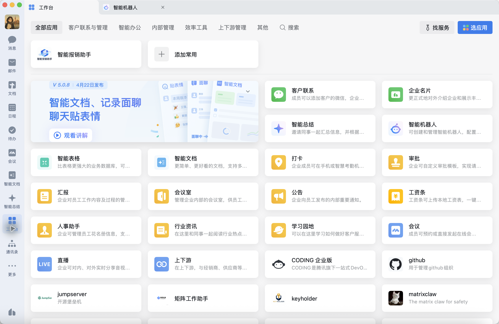
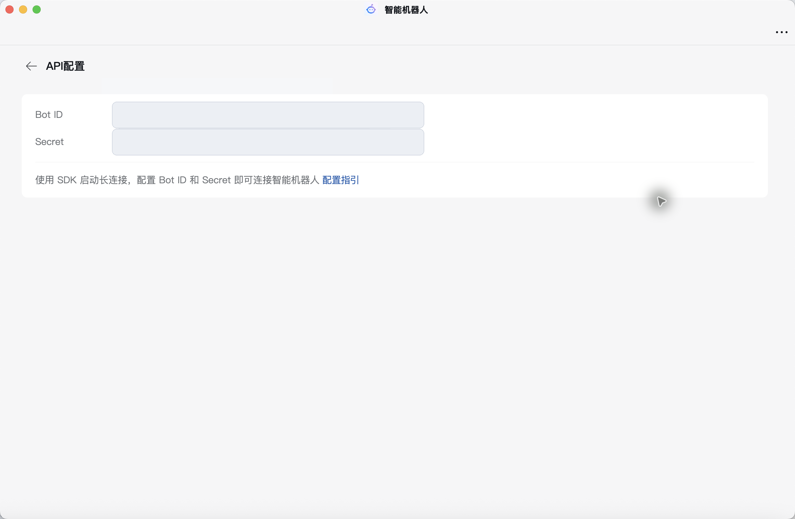
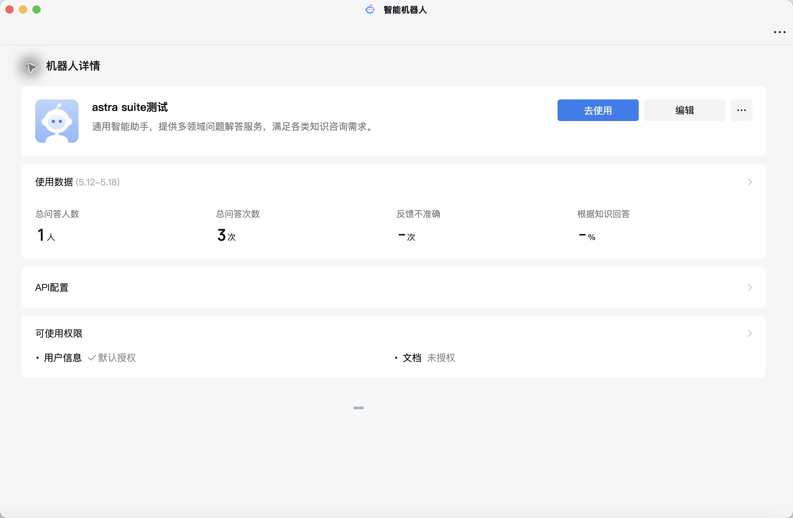
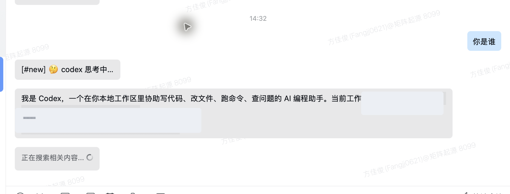

# 企业微信 Astra Bot 配置教程

本文介绍如何把 `astra-suite` 里的 `astra-gateway` 接入企业微信智能机器人，让团队成员可以在企业微信里直接和 Codex / Claude / Astra 等 Agent CLI 对话。

> 适用场景：企业微信智能机器人 + API 模式 + 长连接。

## 1. 最终效果

配置完成后，链路如下：

```text
企业微信用户 / 群聊
        ↓
企业微信智能机器人（API 模式，长连接）
        ↓
astra-gateway
        ↓
Codex / Claude / Astra / Custom CLI
        ↓
企业微信回复
```

用户可以在企业微信里发送：

```text
/status
/workspace /Users/lushan/Desktop/astra-suite
帮我看一下这个项目是做什么的
帮我跑一下测试并总结失败原因
```

## 2. 准备工作

### 2.1 从 GitHub 拉取项目

先把 `astra-suite` 拉到本机。下面以官方仓库为例，如果团队使用自己的 fork，把 GitHub 地址替换成对应仓库即可：

```bash
cd ~/Desktop
git clone https://github.com/matrixorigin/astra-suite.git
cd astra-suite
```

确认项目已经拉取成功：

```bash
git status
ls
```

正常情况下，目录里会看到 `Cargo.toml`、`crates/`、`scripts/`、`README.md` 等文件。

如果本机已经有这个项目，只需要进入目录并拉取最新代码：

```bash
cd ~/Desktop/astra-suite
git pull --ff-only
```

### 2.2 本机准备

确认本机已安装 `astra-gateway`：

```bash
astra-gateway --version
```

如果还没有安装，可以在刚才拉取的 `astra-suite` 项目目录里运行：

```bash
sh scripts/install.sh -d "$HOME/.local/bin" -y
```

如果 `$HOME/.local/bin` 不在 PATH 里，可以临时执行：

```bash
export PATH="$HOME/.local/bin:$PATH"
```

### 2.3 Codex 后端准备

本机需要有一个可用的 Codex CLI 后端。当前推荐把 API Key 放到独立文件：

```bash
mkdir -p ~/.astra-gateway
chmod 700 ~/.astra-gateway
cat > ~/.astra-gateway/codex.env <<'EOF'
CODEX_API_KEY=你的_codex_api_key
EOF
chmod 600 ~/.astra-gateway/codex.env
```

如果使用本机 Codex App 自带的 Codex CLI，可以创建一个 wrapper：

```bash
cat > ~/.astra-gateway/codex-direct <<'EOF'
#!/bin/sh
set -eu

env_file="$HOME/.astra-gateway/codex.env"
if [ -f "$env_file" ]; then
  . "$env_file"
  export CODEX_API_KEY
fi

exec /Applications/Codex.app/Contents/Resources/codex "$@"
EOF
chmod 700 ~/.astra-gateway/codex-direct
```

验证 Codex 非交互调用：

```bash
~/.astra-gateway/codex-direct exec --sandbox read-only --skip-git-repo-check --json '请只回复OK'
```

看到 JSONL 里出现类似内容，说明 Codex 后端可用：

```json
{"type":"item.completed","item":{"type":"agent_message","text":"OK"}}
```

## 3. 在企业微信创建智能机器人

> 建议使用企业微信电脑客户端最新版，手机端可能看不到完整的 API 模式配置入口。

### 3.1 打开智能机器人入口

在企业微信电脑客户端中：

```text
工作台 → 智能机器人 → 创建机器人 → 手动创建
```

企业微信里的入口位置如下：



如果已经创建过机器人，也可以在「智能机器人」详情页里继续管理；如果是第一次配置，点击创建入口后进入手动创建流程。

### 3.2 填写机器人基础信息

填写：

- 机器人名称，例如：`Astra Bot`
- 头像
- 简介，例如：`团队代码助手，可通过企业微信调用 Codex/Astra`
- 可见范围：建议先只给测试成员或测试部门开放

第一次配置时建议先限制可见范围，不要直接开放给全公司。确认用量、权限和回复行为稳定后，再扩大范围。

### 3.3 选择 API 模式创建

在创建页面底部，选择：

```text
API 模式创建
```

不要选择普通 Webhook 群机器人。Astra Gateway 使用的是企业微信智能机器人的长连接能力。

### 3.4 选择长连接方式

在 API 配置区域里选择：

```text
连接方式：使用长连接
```

选择长连接后，页面会给出：

- `Bot ID`
- `Secret`

复制并保存这两项。Secret 通常只展示一次，丢失后需要重新生成。

API 配置页如下：



### 3.5 保存机器人

完成后点击保存。保存后，可以在机器人详情页确认：

- 机器人已启用
- 可见范围正确
- API 模式为长连接
- Bot ID 可见

保存后可以回到机器人详情页检查状态：



## 4. 配置 astra-gateway

### 4.1 生成配置文件

如果还没有配置文件，运行：

```bash
astra-gateway init
```

默认配置路径：

```text
~/.astra-gateway/config.yaml
```

### 4.2 填写企业微信 Bot ID 和 Secret

编辑：

```bash
vim ~/.astra-gateway/config.yaml
```

写入企业微信长连接凭证：

```yaml
platforms:
  wecom:
    enabled: true
    bot_id: "你的企业微信 Bot ID"
    secret: "你的企业微信 Secret"
```

这里填的是智能机器人 API 模式长连接里的 `Bot ID` 和 `Secret`，不要填 URL 回调模式的 `Token` / `EncodingAESKey`，也不要填普通群机器人的 Webhook key。

### 4.3 配置 Codex 后端

如果使用上面创建的 `codex-direct` wrapper，`cli` 配置建议如下：

```yaml
cli:
  type: codex
  bin: /Users/lushan/.astra-gateway/codex-direct
  sandbox: workspace-write
  stream_json: true
```

完整最小配置示例：

```yaml
cli:
  type: codex
  bin: /Users/lushan/.astra-gateway/codex-direct
  sandbox: workspace-write
  stream_json: true

platforms:
  wecom:
    enabled: true
    bot_id: "你的企业微信 Bot ID"
    secret: "你的企业微信 Secret"
```

### 4.4 推荐增加 workspace 限制

如果给团队使用，建议只允许机器人访问指定项目目录：

```yaml
action_policy:
  allow_slash_mutations: true
  allow_model_generated_mutations: false
  workspace_roots:
    - /Users/lushan/Desktop/astra-suite
    - /Users/lushan/Desktop/moi-prototype
    - /Users/lushan/Desktop/mo-website-redesign
```

这样用户通过 `/workspace` 切换目录时，只能切到允许的目录。

## 5. 启动和验证

### 5.1 启动网关

```bash
astra-gateway start
```

查看状态：

```bash
astra-gateway status
```

成功时会看到类似：

```text
astra-gateway: running
config: /Users/lushan/.astra-gateway/config.yaml
log:    /Users/lushan/.astra-gateway/gateway.log
pid:    /Users/lushan/.astra-gateway/gateway.pid
```

### 5.2 确认企业微信长连接

可以查看进程是否有到 443 端口的连接：

```bash
lsof -Pan -p "$(cat ~/.astra-gateway/gateway.pid)" -i
```

如果看到类似 `ESTABLISHED` 的 443 连接，说明进程正在和远端服务保持连接。

### 5.3 在企业微信里发测试消息

私聊机器人：

```text
/status
```

或者：

```text
你是谁
```

群聊中建议先 `@机器人名称`：

```text
@Astra Bot /status
```

如果机器人有回复，说明完整链路已经跑通：

```text
企业微信 → astra-gateway → Codex → astra-gateway → 企业微信
```

下面是企业微信私聊机器人返回 Codex 回复的实际效果：



群聊里测试时，记得先把机器人加入群聊，并用 `@机器人名称` 触发，例如：

```text
@Astra Bot 你是谁
```

## 6. 查看消息状态

`astra-gateway` 的运行日志文件：

```text
~/.astra-gateway/gateway.log
```

查看最近日志：

```bash
tail -200 ~/.astra-gateway/gateway.log
```

持续跟随日志：

```bash
tail -f ~/.astra-gateway/gateway.log
```

消息状态更多记录在 SQLite 数据库：

```text
~/.astra-gateway/gateway.db
```

查看最近收到的请求：

```bash
sqlite3 -header -column ~/.astra-gateway/gateway.db "
SELECT created_at, status, platform, cli_profile,
       substr(chat_id,1,18) AS chat,
       substr(user_id,1,18) AS user,
       substr(text,1,80) AS text,
       error_message
FROM gw_trace_requests
ORDER BY created_at DESC
LIMIT 20;
"
```

查看 Codex 运行状态：

```bash
sqlite3 -header -column ~/.astra-gateway/gateway.db "
SELECT started_at, finished_at, status, cli_profile,
       exit_code, substr(error_message,1,120) AS error_message
FROM gw_trace_runs
ORDER BY started_at DESC
LIMIT 20;
"
```

查看回复是否发送成功：

```bash
sqlite3 -header -column ~/.astra-gateway/gateway.db "
SELECT created_at, sent_at, status, platform,
       retry_count, substr(body,1,120) AS body,
       substr(error_message,1,120) AS error_message
FROM gw_trace_outbox
ORDER BY created_at DESC
LIMIT 20;
"
```

常见状态含义：

| 表 | 状态 | 含义 |
|---|---|---|
| `gw_trace_requests` | `completed` | 企业微信消息已完整处理 |
| `gw_trace_runs` | `succeeded` | Codex / Agent CLI 调用成功 |
| `gw_trace_outbox` | `sent` | 回复已发送回企业微信 |

## 7. 常见问题排查

### 7.1 启动后立刻退出

查看状态：

```bash
astra-gateway status
```

查看日志：

```bash
tail -200 ~/.astra-gateway/gateway.log
```

如果看到：

```text
wecom: bot_id and secret required
no adapters started
```

说明 `bot_id` 或 `secret` 为空，或者配置文件路径不是你正在编辑的那一个。

### 7.2 企业微信能发消息，但机器人不回复

检查数据库是否收到消息：

```bash
sqlite3 -header -column ~/.astra-gateway/gateway.db "
SELECT created_at, status, text, error_message
FROM gw_trace_requests
ORDER BY created_at DESC
LIMIT 10;
"
```

判断：

- 没有新记录：企业微信长连接或可见范围可能有问题。
- 有新记录但 run 失败：Codex / Claude / Astra 后端可能有问题。
- outbox 不是 `sent`：企业微信发送回复可能失败。

### 7.3 收到 Codex 欢迎页或公告

如果企业微信回复里出现：

```text
Welcome to Codex
Checking announcements
Press Enter to continue
```

说明使用的是交互式 Codex launcher，不适合直接放在 gateway 后台运行。建议改成 `codex-direct` wrapper，并确保 Codex 非交互测试能正常返回。

### 7.4 Codex 返回 402 / no active subscription

如果看到：

```text
402 Payment Required
Access denied: No active subscription
```

说明 Codex key 或账号订阅不可用。需要更换可用的 `CODEX_API_KEY`，然后重启：

```bash
astra-gateway restart
```

如果没有 `restart` 子命令，可以：

```bash
astra-gateway stop
astra-gateway start
```

### 7.5 修改配置后没有生效

重启 gateway：

```bash
astra-gateway stop
astra-gateway start
astra-gateway status
```

确认当前进程使用的配置路径：

```bash
astra-gateway status
```

## 8. 安全建议

### 8.1 密钥不要写进仓库

不要把这些内容提交到 Git：

- 企业微信 `Secret`
- Codex API Key
- `~/.astra-gateway/config.yaml`
- `~/.astra-gateway/codex.env`
- `~/.astra-gateway/gateway.db`

建议权限：

```bash
chmod 600 ~/.astra-gateway/config.yaml
chmod 600 ~/.astra-gateway/codex.env
chmod 700 ~/.astra-gateway/codex-direct
```

### 8.2 密钥泄露后要立即轮换

如果 Secret 或 API Key 曾经对外暴露，应当重新生成：

- 企业微信后台重新生成机器人 Secret。
- Codex 平台重新生成 API Key。
- 更新本机配置并重启 gateway。

### 8.3 先小范围试用

建议第一阶段只开放给：

- 机器人创建者
- 测试群
- 核心研发成员

确认权限、用量、回复质量后，再扩大范围。

## 9. 推荐团队使用方式

### 9.1 常用命令

```text
/help
/status
/new
/workspace /Users/lushan/Desktop/astra-suite
/usage
/trace <trace_id>
```

### 9.2 项目分析

```text
@Astra Bot 帮我看一下这个项目是做什么的
```

```text
@Astra Bot 帮我检查最近一次测试失败的原因
```

### 9.3 定时任务

可以让机器人做周期性任务，例如：

```text
每天晚上10点帮我总结一下 /Users/lushan/Desktop/astra-suite 的 git 状态和未完成事项
```

实际是否允许模型自动创建定时任务，取决于：

```yaml
action_policy:
  allow_model_generated_mutations: true
```

如果不希望模型自动改状态，保持 `false`，用 slash command 手动创建。

### 9.4 节省用量

如果已安装 RTK，可以让 Codex 在执行 shell 命令时尽量使用：

```bash
rtk git status
rtk cargo test
rtk npm run build
```

全局 Codex 指令可放在：

```text
~/.codex/AGENTS.md
~/.codex/RTK.md
```

## 10. 参考资料

- [Kimi Claw：配置企业微信机器人](https://www.kimi.com/zh-cn/help/kimi-claw/wecom-bot)
- [CodeBuddy：企业微信智能机器人接入指南](https://www.codebuddy.ai/docs/zh/cli/wecom-bot-setup)
- [LangBot：部署企业微信智能机器人](https://docs.langbot.app/zh/usage/platforms/wecom/wecombot)
- [Hermes Agent：WeCom Enterprise WeChat](https://www.majiabin.com/hermes/user-guide/messaging/wecom/)
